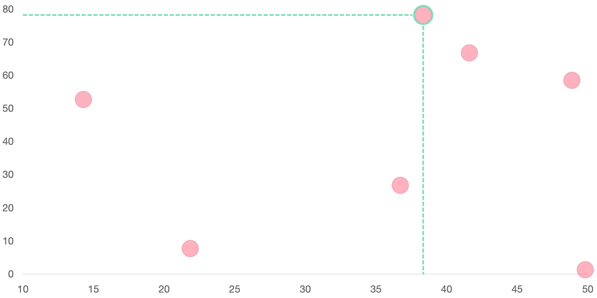

# Chart.js Custom

## Bubble | Selected Point and Show Horizol and Vertical Line

- remove xAxis grid and remove yAxis grid and border
- hover on the point change cursur to pointer
- select an point and draw a border around the point
- select an point and draw the horizol and vertical line

